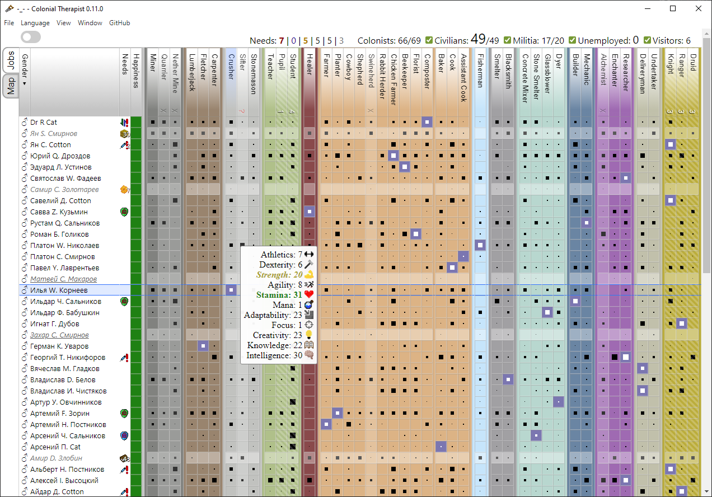

# Colonial-Therapist

Colonist management tool on mod [MineColonies](https://minecolonies.com/) for [Minecraft](https://www.minecraft.net/).

This program allows you to analyze the state of your colony. Who works where, the needs and happiness of citizens.

The inspiration was the [Dwarf-Therapist](https://github.com/Dwarf-Therapist/Dwarf-Therapist) project for the game [Dwarf Fortress](http://www.bay12games.com/dwarves/) ([steam](https://store.steampowered.com/app/975370/Dwarf_Fortress/)).

## How to use

1. Launch the program.
2. Select the folder with the saved world. 
If you don't know where your world lies, you can find it by configuring resource Packs (Options... -> Resource Packs... -> Open Pack Folder).
3. Choose a colony. Now automatically selects the first one.

Saves all user settings in the home directory (<home dir>/.Colonial-Therapist/).
If something went wrong, try deleting the config.json file.

## ROAD MAP

- [x] ~~send message in console~~
- [x] ~~print text in main window~~
- [x] ~~read txt file~~
- [x] ~~view text from file in main window~~
- [x] ~~read local nbt file~~
- [x] ~~parsing data~~
- [x] ~~read nbt file .minecraft\saves\WORLD\minecolonies\minecraft\overworld\colony1.dat~~
- [x] ~~life reloading app~~
- [x] ~~read nbt file capabilities.dat~~
- [ ] get citizens, skills and jobs (houses)
  - [ ] get citizens
    - [x] ~~happiness~~
    - [ ] happiness refactoring
    - [x] ~~needs~~
    - [x] ~~childs~~
    - [ ] current task (job)
    - [ ] weapons (military)
    - [x] ~~skills~~
    - [ ] level
    - [ ] home
    - [x] ~~job~~
    - [x] ~~gender~~
  - [x] ~~get skills~~
    - [x] ~~skill registry~~
  - [ ] get jobs (houses)
    - [x] ~~list of house names~~
    - [x] ~~building levels~~
    - [x] ~~skills assessment system~~
    - [x] ~~custom name~~
    - [ ] library student and pupil
  - [x] ~~get visitors~~
    - [x] ~~costs~~
    - [x] ~~skills~~
    - [x] ~~happiness~~
    - [x] ~~gender~~
- [ ] convert data to table
  - [x] ~~base table~~
  - [x] ~~icons for skills~~
  - [x] ~~happiness~~
  - [x] ~~color columns~~
  - [x] ~~fill table~~
  - [x] ~~genders~~
  - [ ] specification of needs
  - [ ] filter by military
  - [x] ~~work capacity~~ 
  - [ ] save sort order before refreshing
  - [x] ~~bug: data is not updated the first time~~
- [x] ~~counter of citizens and workers~~
- [ ] refactoring create table
- [ ] save config in home dir
  - [x] create default config in home dir
  - [x] read config from home dir
  - [x] selecting a folder with a world with an empty config
  - [ ] select colonies
  - [x] edit config
  - [x] history opening the worlds dir
- [x] ~~reading while game is running~~
- [x] ~~updating the table when changing the mod file~~
- [ ] grave
- [x] configure app builder
- [x] ~~add icon app~~
- [ ] debug mode
- [x] ~~choose a license~~
- [x] ~~create a repository on GitHub~~
- [x] multilingualism

## License

Colonial-Therapist is free software: you can redistribute it and/or modify it under the terms of the GNU General Public License as published by the Free Software Foundation, either version 3 of the License, or (at your option) any later version.

Colonial-Therapist is distributed in the hope that it will be useful, but WITHOUT ANY WARRANTY; without even the implied warranty of MERCHANTABILITY or FITNESS FOR A PARTICULAR PURPOSE. See the GNU General Public License for more details.

You should have received a copy of the GNU General Public License along with Colonial-Therapist. If not, see <https://www.gnu.org/licenses/>.